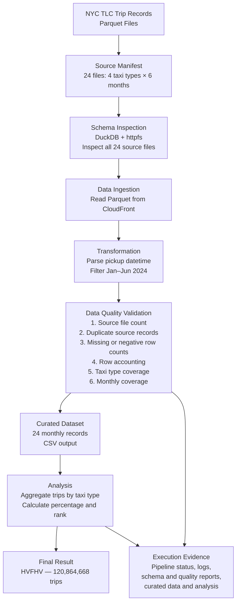

# NYC Taxi Data Pipeline — Architecture

```mermaid
flowchart TD
    A["NYC TLC Trip Records<br/>Parquet Files"]
    B["Source Manifest<br/>24 files: 4 taxi types × 6 months"]
    C["Schema Inspection<br/>DuckDB + httpfs<br/>Inspect all 24 source files"]
    D["Data Ingestion<br/>Read Parquet from CloudFront"]
    E["Transformation<br/>Parse pickup datetime<br/>Filter Jan–Jun 2024"]
    F["Data Quality Validation<br/>1. Source file count<br/>2. Duplicate source records<br/>3. Missing or negative row counts<br/>4. Row accounting<br/>5. Taxi type coverage<br/>6. Monthly coverage"]
    G["Curated Dataset<br/>24 monthly records<br/>CSV output"]
    H["Analysis<br/>Aggregate trips by taxi type<br/>Calculate percentage and rank"]
    I["Final Result<br/>HVFHV — 120,864,668 trips"]
    J["Execution Evidence<br/>Pipeline status, logs,<br/>schema and quality reports,<br/>curated data and analysis"]

    A --> B
    B --> C
    C --> D
    D --> E
    E --> F
    F --> G
    G --> H
    H --> I
    F --> J
    H --> J
```
